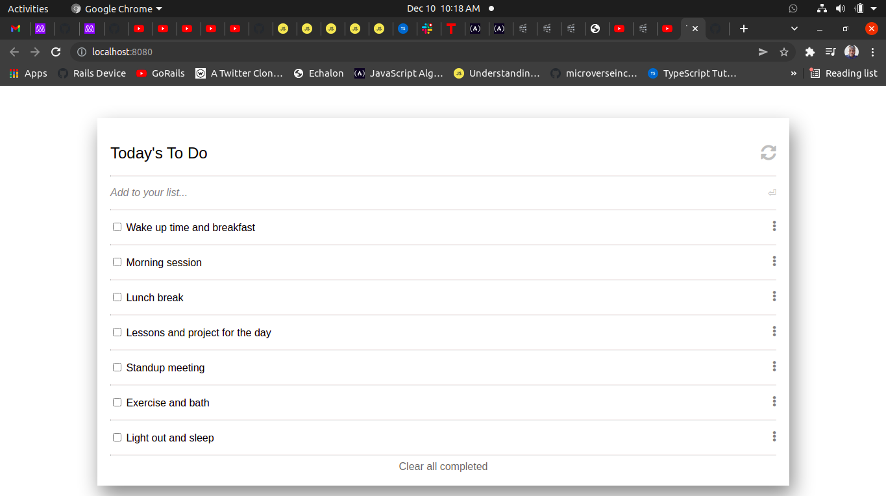

# TO-DO Task App

> In this project, I built a simple TO-DO list App. The project has three milestones:
1. The list  structure - Majorly the HTML markup.
2. Interactive list -Making the App interactive and adding basic functionalities.
3. Add and Remove - To be able to add and remove tasks in the app.

 This was achieved using plain JavaScript with objects and arrays, that allows users to add/remove tasks from a list.

  
## Built With

- JavaScript
- HTML and CSS
- Bootstrap

## Live Demo

[Live Demo Link](https://charlyeneh.github.io/To-Do-Tasks-App/)

## Getting Started

**Instructions on setting up your project locally.**
The project could be accessed by visiting the website link.

## Authors

👤 **Eneh Charles Chukwunweike**

- GitHub: [@charlyeneh](https://github.com/charlyeneh)
- Twitter: [@twitterhandle](https://twitter.com/ProgrammerBaby?s=09)
- LinkedIn: [LinkedIn](https://www.linkedin.com/in/charles-chukwunweike-eneh-5345a2147)

## 🤝 Contributing

Contributions, issues, and feature requests are welcome!

## Show your support

Give a ⭐️ if you like this project!

## Acknowledgments

- Hat tip to anyone whose code was used
- Inspiration
- etc

## 📝 License

This project is [MIT](./MIT.md) licensed.
